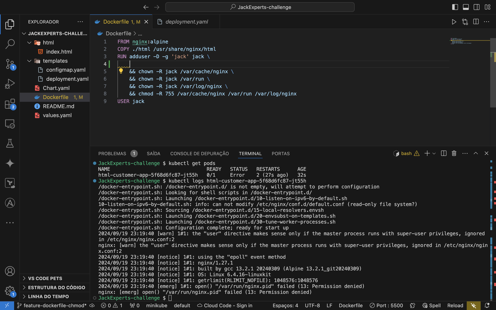
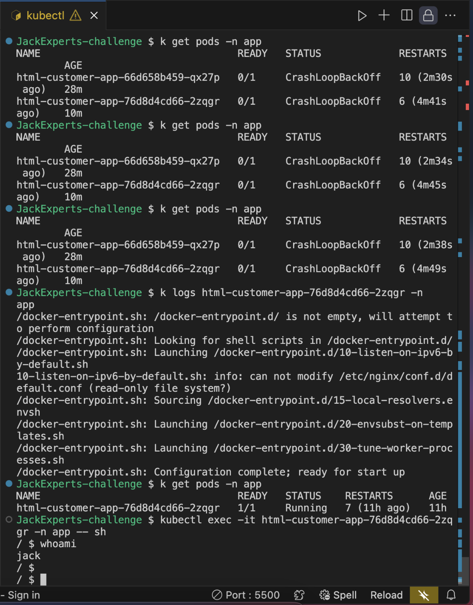
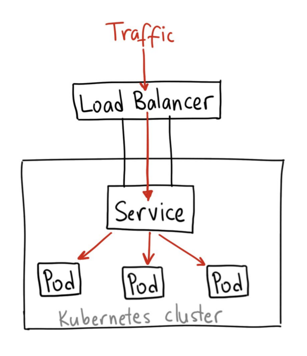
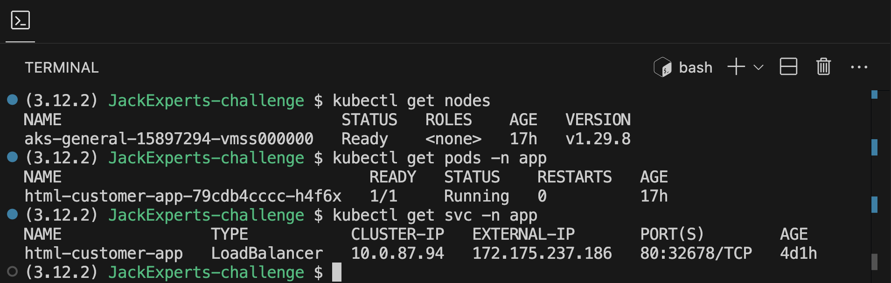
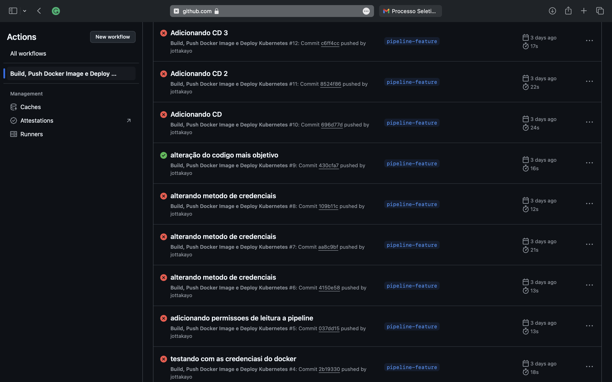
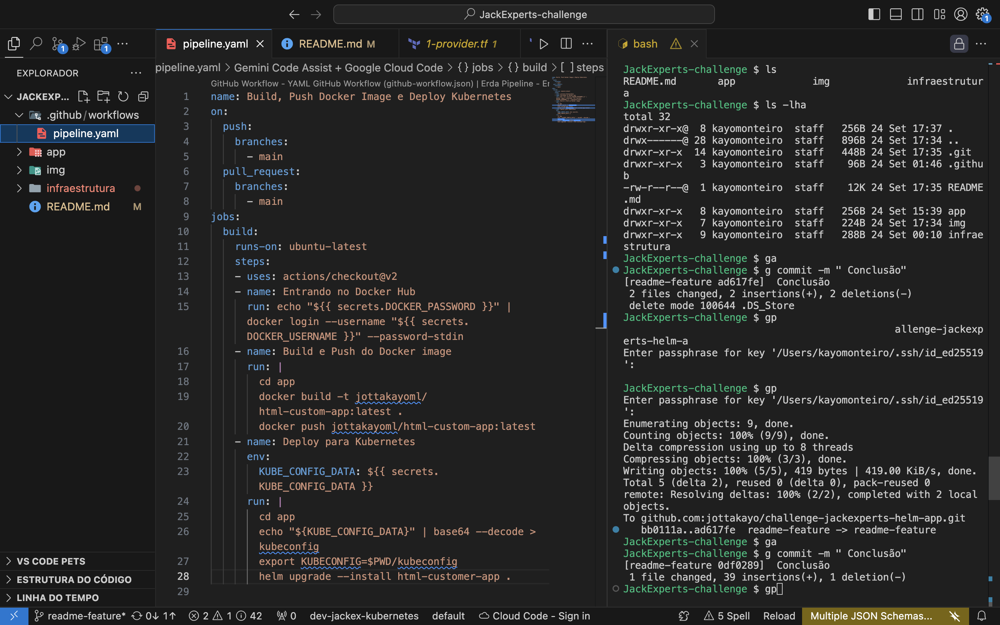
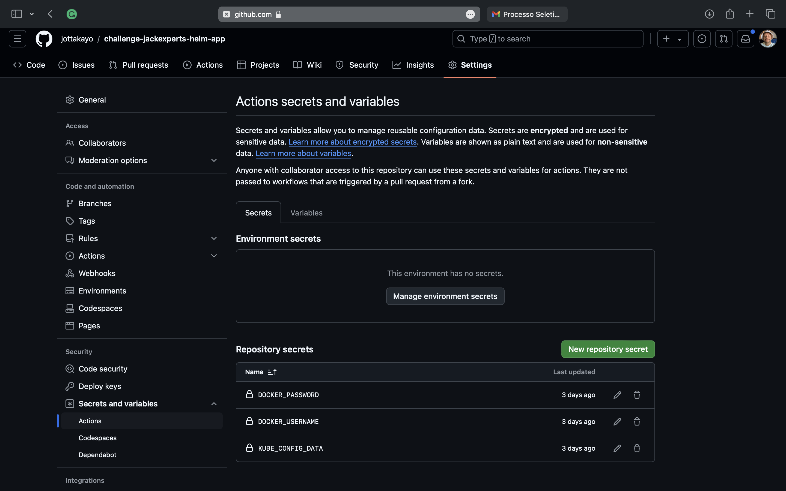

# Aplicação HTML Customizável com Kubernetes e Helm


## Introdução

### Descrição do Projeto
O objetivo deste projeto é subir uma página HTML que pode ser facilmente customizada via **ConfigMap** no **Kubernetes**, sem precisar de reconstruir a imagem **Docker**. Dentro do ambiente **DevOps**, o projeto monstra Cloud Native através da Azure e IaC, mostrando o gerenciamento tanto do código do projeto quanto das suas configurações usando **Helm** e **Kubernetes**.


## Arquitetura e Ferramentas Utilizadas

Ferramentas utilizadas para rodar o projeto:

- **Docker**: Usado para containerizar a aplicação NGINX com a página HTML.
    - [Documentação do Docker](https://docs.docker.com/)
    - [O que é Docker?](https://www.docker.com/resources/what-container)
    - [Instalação do Docker](https://docs.docker.com/get-docker/)

- **Kubernetes (AKS)**: Gerenciamento do ciclo de vida do aplicativo através do cluster Kubernetes na Azure. 
    - [Documentação do Kubernetes](https://kubernetes.io/docs/home/)
    - [Azure Kubernetes Service (AKS)](https://learn.microsoft.com/en-us/azure/aks/)
    - [Instalação do Kubectl](https://kubernetes.io/docs/tasks/tools/)

- **Helm**: Implementado para gerenciar os deployments com controle sobre a configuração dinâmica da Pagina.
    - [Documentação do Helm](https://helm.sh/docs/)
    - [Sobre Helm Charts](https://helm.sh/docs/chart_template_guide/getting_started/)
    - [Instalação do Helm](https://helm.sh/docs/intro/install/)

- **Terraform**: Cria o cluster AKS automatizado, usando IaC para manter a infraestrutura replicável caso preciso. 
    - [Documentação do Terraform](https://developer.hashicorp.com/terraform/docs)
    - [Introdução ao Terraform](https://learn.hashicorp.com/terraform)
    - [Instalação do Terraform](https://developer.hashicorp.com/terraform/install)
- **CI/CD Pipeline (GitHub Actions)**: Configurado para automação do build, push da imagem Docker no Docker Hub e deploy no cluster AKS usando Helm(upgrade).
    - [Documentação do GitHub Actions](https://docs.github.com/en/actions)
    - [Introdução do GitHub Actions](https://docs.github.com/en/actions/learn-github-actions/introduction-to-github-actions)
- **Azure CLI**: CLI usada para interagir na nuvem da AKS.
    - [Instalação e documentação do Azure CLI](https://learn.microsoft.com/en-us/cli/azure/install-azure-cli)

> **Dica:**  Dê uma boa olhada se as ferramentas foram configuradas e nas versões mais atuais, para evitar erros.

## Estrutura do Projeto

### `.github/workflow/`

#### arquivo: `pipeline.yaml`

Mostra o pipeline CI/CD usando o GitHub Actions para rodar os Jobs, responsável por:
- Construção da imagem Docker.
- Exportação para o DockerHub
- Deploy no Kubernetes via Helm (Install).

**Referência**:
- [Artigo para entendimento do assunto em geral](https://www.linkedin.com/pulse/como-criar-um-pipeline-de-cicd-com-o-github-actions-em-quatro-/)
- [Pipeline com Kubernetes](https://github.com/actions-hub/kubectl)

---

### `App/`

#### Arquivo: `html/index.html`

Página com HTML mostrada pelo NGINX, configurada dinamicamente via ConfigMap no Kubernetes.

**Referência**:
- [Kubernetes ConfigMap](https://medium.com/@teme_24/customizing-nginx-html-file-using-kubernetes-configmap-64c715f7512a)

---

#### Diretório: `templates/`

Contém os templates Helm que definem os recursos do Kubernetes, como `ConfigMap`, `Deployment` e `Service`...

**Referência**:
- [Gui do Chart](https://medium.com/@maths.nunes/criando-e-instalando-um-chart-com-o-helm-c3504dc63419)

---

#### Arquivo: `dockerfile`

Mostra como a imagem é empacotada numa imagem Docker com NGINX, configurando permissões para rodar com um usuário não-root.

**Referência**:
- [NGINX](https://hub.docker.com/_/nginx)
- [Umas boas práticas com o Dockerfile](https://docs.docker.com/develop/develop-images/dockerfile_best-practices/)

---

#### Arquivo: `values.yaml`

Vai declarar valores usados pelos templates Helm, Deixa mais simples as mudanças da aplicação sem modificar diretamente os templates.

**Referência**:
- [Helm values.yaml](https://helm.sh/pt/docs/glossary/#:~:text=Valores%20de%20Configuração%20(values.&text=Valores%20de%20configuração%20são%20uma,ser%20sobrescritas%20durante%20a%20instalação.))

---

#### Arquivo: `chart.yaml`

Metadados(Pequenas informações) sobre o Helm chart, como o nome.

**Referência**:
- [Helm chart.yaml](https://www.freecodecamp.org/portuguese/news/o-que-e-um-helm-chart-um-tutorial-para-iniciantes-no-kubernetes/)

---

### `Infraestrutura/`

Tem os arquivos do Terraform usados para provisionar o cluster AKS.

**Referência**:
- [Tutorial da Hashicorp](https://learn.hashicorp.com/tutorials/terraform/aks)

---

## Fluxo do CI/CD

1. A pipeline olha as alterações e builda a imagem Docker.
2. A imagem é publicada no Docker Hub.
3. Helm atualiza a aplicação no Kubernetes com os novos valores de `values.yaml` e ConfigMap.

# Configuração da Imagem Docker


## Pontos Mais Importantes

### Imagem Base
A imagem `nginx:alpine` é pequena e leve. Especificado a plataforma `amd64` por conta do meu cluster AKS, a minha imagem estava gerando a plataforma da minha maquina.

### Criação de Usuário Não-root
Criado o usuário `jack` para rodar o NGINX sem privilégios de root, por segurança. Garantido que todos os diretórios necessários do NGINX fosse de propriedade do `jack`, evitando problemas de permissão como o da imagem abaixo.



### Ajuste de Permissões e Arquivo `.pid`
O arquivo `.pid` do NGINX foi criado e as permissões foram ajustadas para `jack`. Sem isso, o NGINX não conseguiria iniciar corretamente como visto na imagem acima, pois não teria permissões suficientes.

```dockerfile
RUN touch /var/run/nginx.pid \
&& chown -R jack:jack /var/run/nginx.pid \
&& chmod -R 755 /usr/share/nginx/html
```

### Permissão para Rodar na Porta 80
A porta 80 requer privilégios de root. O `setcap` usado, permitiu que NGINX acesse a porta 80 mesmo rodando com o `jack`que não tem permissão de root, mas já que estou usando a versão `nginx:alpine` que é pequena e leve usei o `libcap` para poder usar o `setcap`.

### Expondo a Porta e Definindo o Usuário
Expus a porta 80 para receber conexões HTTP e definindo o user `jack` como o usuário que irá rodar no NGINX.

```dockerfile
EXPOSE 80
USER jack
```


## Criação da Estrutura do Helm Chart

Antes de seguir com a configuração, crie a estrutura do seu Helm Chart com o seguinte comando:

### Gestão da Configuração com Helm

Comando usado para gerar a estrutura básica de diretórios e arquivos do Helm Chart.

```
helm create < Metadata >
```

## Estrutura dos Arquivos do Helm Chart

### chart.yaml 

**Metadado:** `Chart.yaml` nele tem os metadados principais do Helm Chart. A versão do Chart (`version`) pode ser usada para contagem de versões.


### Configmap.yaml

**Dinamismo:** O `configmap.yaml` contém o template do HTML com placeholders (`{{ .Values.<variável> }}`) que foram substituídos pelos valores definidos no arquivo `values.yaml`. Isso permitiu customizar a página HTML sem precisar modificar ou reconstruir a imagem Docker.

Comando para verificar o conteúdo dentro do ConfigMap:

```
kubectl describe configmap html-customer-config(nome do configmap) -n(namespace) app(Nome do namespace)
```
Existem formas diferentes de especificar os valores no `configmap.yaml`, o utilizado foi expor o HTML por completo, deve-se seguir bem a sintaxe do .yaml caso contrario ocorrera erros na chamada da variável.
### values.yaml

**Variáveis:**  `Values.yaml` tem os valores que foram injetados no HTML através do ConfigMap. As alterações no arquivo são automaticamente refletidas no conteúdo da página HTML sem a necessidade de rebuilds da image.

## Teste e veja a Aplicação no Cluster

Depois de realizar o deploy da aplicação com Helm, é importante testar e verificar se tudo está funcionando bem, a imagem a seguir é a pratica de como pode acontecer essa verificação.

- **Comando para verificar o ConfigMap e o Pod no cluster:**
- **Comando para visualizar os logs da aplicação:**



Com esses comandos, vai garantir que o ConfigMap foi criado corretamente, que os Pods estão funcionando e que o conteúdo HTML foi renderizado conforme esperado.

## Provisionamento de Infraestrutura com Terraform

### Definido Variáveis locais (locais.tf)

O `locais.tf` contém os valores locais que foram reutilizados em vários pontos da infraestrutura criada:

- **env**: Dar ambientes para facilitar a replicação em diferentes contextos.
- **region**: Define a região da Azure onde os recursos da azure serão implantados.
- **resource_group_name**: É o nome criado do grupo de recursos, serve pra agrupar todos os serviços.
- **eks_version** e **orchestrator_version**: Versão do Kubernetes que foi utilizada.
- **node_count** e **enable_auto_scaling**: Controla o número de nós no cluster criado e se o auto-escalamento está habilitado(que nesse caso, não esta).
- **vm_size**: Tamanho da VM utilizada para os nós, `Standard_B2s`.

### Provedor (provider.tf)

O provedor da Azure (`azurerm`):

- **"azurerm"**: Declara o uso da Azure como provedor.
- **terraform backend**: O backend define onde o estado do Terraform será armazenado.

### Rede Virtual (vpc.tf)

A criação de uma rede virtual é importante para a comunicação entre os recursos.

- **azurerm_virtual_network**: VNet com o espaço de endereço `10.0.0.0/16`.

### Subnets (subnets.tf)

- **azurerm_subnet**: Permite o controle do tráfego e recursos alocados a cada subnet.

### Cluster AKS (aks.tf)

A criação do cluster AKS:

- **kubernetes_version**: Definido no `locais.tf`.
- **node_resource_group**: Cria um grupo de recursos específico para os nós.
- **network_profile**: Configura o plugin de rede "azure".
- **default_node_pool**: Define o pool de nós.
- **identity**: O cluster usa uma identidade gerenciada pelo sistema (`SystemAssigned`).

### Variáveis (variables.tf)

Usar variáveis no Terraform torna mais fácil reutilizar os valores em vários arquivos e cenários. As variáveis definidas (`resgroup_name`, `storage_account`, `default_location`)aumentam o dinamismo do código.

---

### Como Obter o Kubeconfig

Uma parte muito importante é pegar o `kubeconfig` para poder interagir com o Kubernetes. Foi feito através de linha de comando através do Azure CLI, dessa forma:

Foi instalado o `az` CLI da azure e feito a autentificação no Azure:
   ```
   az login
   ```
e execução do comando,
 ```
   az aks get-credentials --resource-group jackex --name jackex-kubernetes
   ```
com esse comando foi permitido executar o kubectl, ai sim pude validar melhor o processo do projeto.

# Deploy no Kubernetes

### O Papel do `deployment.yaml`

O objeto `deployment.yaml` é essencial pra orquestrar a implantação dos contêineres no Kubernetes. Define vários visões, como a quantidade das réplicas que a aplicação deve ter, o jeito que vai ser exposta, quais imagens Docker utilizar. É nele também que são definidas as configurações de segurança, como a pauta do usuário que o contêiner vai executar.

Esse objeto se torna o ponto central de controle de todos os arquivos relacionados à execução do aplicativo dentro de um cluster Kubernetes. Nele tem:

1. **Replicas**: Tem a quantidade de instâncias da aplicação em execução.
2. **Containers**: A definição das imagens Docker e suas configurações.
3. **Volumes**: A ligação entre o contêiner e os dados persistentes ou arquivos de configuração.
4. **Contexto de Segurança**: Permissões dos contêineres que serão executados, como a do usuário que não é `root`.

### Exposição Externa com o Service LoadBalancer 

Uma parte do deploy foi a exposição do serviço ao tráfego externo. Utilizei o **Service** do tipo **LoadBalancer**. O Kubernetes, por padrão, não expõe os pods diretamente ao tráfego externo(Acredite). Assim, o **Service LoadBalancer** atua como um intermediário, criando um IP externo e garantindo que o tráfego externo exista.



---

### <span style="font-size: 2em;">∞</span>  ⚙️ EXTRA: Pipeline CI/CD com GitHub Actions ⚙️ <span style="font-size: 2em;">∞</span>

#### Estrutura do Pipeline:
1. **Ação ao Push na branch principal:**
   O pipeline é disparado automaticamente sempre que um push ou pull request é feito na branch `main`.

2. **Build e Push da Imagem Docker:**
   Dado o push, a pipeline constrói a imagem Docker da aplicação a partir do diretório `app`, no arquivo Dockerfile. E então faz o push da imagem para o Docker Hub, e assim a versão mais recente da aplicação vai esta disponível no repositório.

````
run: |
        cd app
        docker build -t jottakayoml/html-custom-app:latest .
        docker push jottakayoml/html-custom-app:latest
````

3. **Deploy Automatizado no Kubernetes (AKS):**
   Depois do push da imagem, a pipeline executa o deploy da aplicação no cluster Kubernetes usando o Helm. Com o comando `helm upgrade --install` garante que a aplicação seja instalada ou atualizada. 

```
run: |
        cd app
        echo "${KUBE_CONFIG_DATA}" | base64 --decode > kubeconfig
        export KUBECONFIG=$PWD/kubeconfig
        helm upgrade --install html-customer-app .
```

4. **Uso de Segredos no GitHub Actions:**
   A pipeline guarda variáveis de ambiente (`secrets`) pra credenciar os logins no Docker Hub e no cluster Kubernetes.

#### CI/CD:
- [Integração continua vs. entrega vs. deployment](https://www.atlassian.com/continuous-delivery/ci-vs-ci-vs-cd)
- [Introdução do CI/CD com o GitHub Actions](https://docs.github.com/en/actions/automating-builds-and-tests/about-continuous-integration)
- [Tutorial do Docker CI/CD Pipeline](https://www.docker.com/blog/docker-github-actions/)

E é com a criação de uma boa pipeline que consegui voltar mais o meu tempo a resolver os desafios do meu código.

---

### Imagens do Projeto

|  |  |  |
|:---------------------------------:|:---------------------------------:|:---------------------------------:|
| **Implantação**                      | **PIPELINE**                      | **Secrets**                      |


---


## Acesse a pagina !!

[](http://challenge-jack.wgsolution.com.br/)

**Clique na imagem acima ou no link abaixo para acessar o site!**

👉 **[Acesse o site aqui!](http://challenge-jack.wgsolution.com.br/)** 👈


---
Desafio realizado para a empresa **JackExperts**.